# Esquema de BD

### Visão Geral do Sistema

Esse projeto tem como objetivo estruturar um banco de dados que representa uma plataforma de educação online, voltada para a área de tecnologia. O sistema é construído através de **instrutores** que, com atributos como nome, biografia e ID, podem ministrar um ou mais **cursos**. Cada curso possui um código de identificação e são adicionados o título, a descrição e a sua categoria. Os cursos são compostos por **aulas**, cada uma composta pelo título, descrição e identificada pela junção do identificador do curso e o título da aula.

### Planos e Usuários

Os cursos são disponibilizados por três **planos** diferentes, sendo eles o **plano iniciante**, **intermediário** e **profissional**, correspondendo respectivamente pela composição apenas de cursos de nível básico, básico e intermediário e, por fim, além desses últimos, os de nível avançado, ou seja, todo o conteúdo disponível. Os **usuários** são identificados pelos seus usernames e também são armazenados seus e-mails e senhas. Cada usuário contrata um plano, com a data de início e término do contrato, sendo os planos disponíveis identificados pelo seu tipo e com a adição de preço.

### Contexto e Escopo Atual

> O sistema é resultado de uma parceria das melhores Universidades dos EUA, e, atualmente conta com cerca de **500 mil cursos** das categorias de Ciência da Computação, Análise de Dados, Redes, Softwares, Negócios, Economia, Inteligência Artificial e Robótica. Existem **50 mil instrutores** envolvidos nesse projeto, com **1 milhão de aulas** disponibilizadas ao todo até o momento. O plano iniciante conta com 200 mil cursos, o intermediário com 350 mil (os do plano iniciante somados a mais 150 mil cursos) e o profissional com todos os 500 mil cursos.

> Até o momento, apenas **30 mil usuários** estão inscritos no serviço, que está disponível apenas em en-US, também por ser de alto nível, com altos requisitos de inscrição e a necessidade de estar matriculado em uma das universidades da parceria, motivo pelo qual ainda há poucos inscritos.

Abaixo está o diagrama de entidade-relacionamento (DER) e o modelo relacional (MR) para facilitar a compreensão do minimundo (DER-MR).

### Perfis de Usuário

Os três perfis de usuário para esse sistema são:
* **Alunos**: Consultam os cursos disponíveis e o instrutor do curso.
* **Instrutores**: Gerenciam os seus cursos e as suas aulas.
* **Administrador do sistema**: Atua no gerenciamento de inscritos e permissões de acesso conforme o plano, entre outras atuações.

Diagrama de Entidade-Relacionamento (DER):

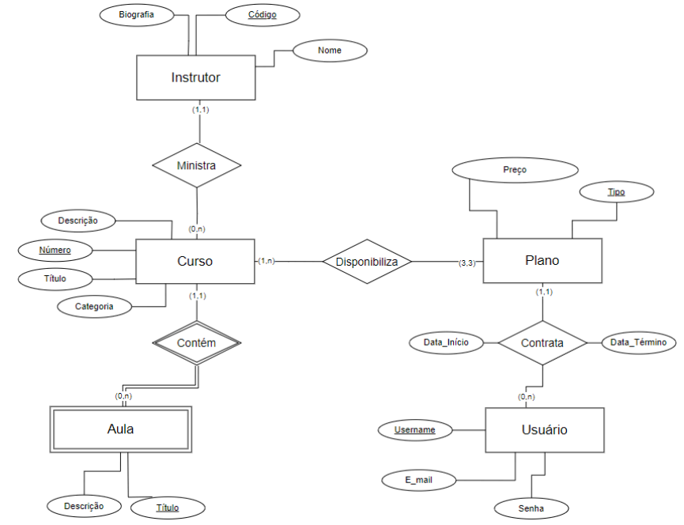

Modelo Relacional (MR):

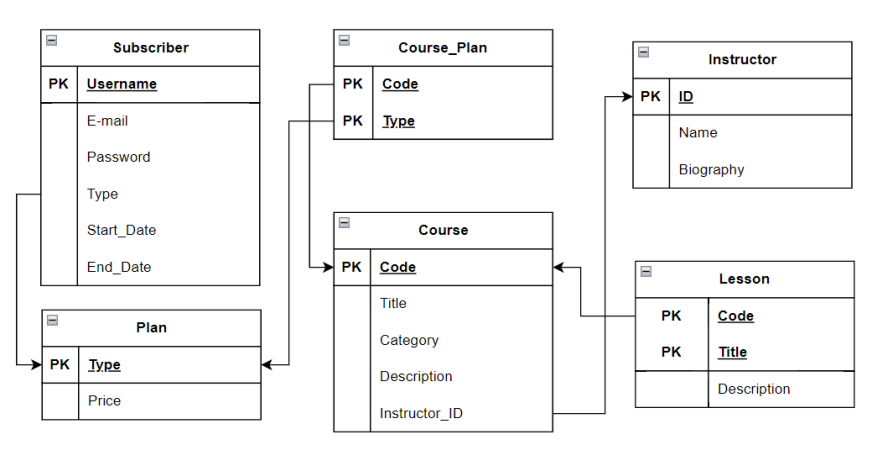

# Populando o BD

Os dados foram gerados utilizando `scripts` com a biblioteca `Faker` do Python. Abaixo estão as especificações de cada tabela com seus dados gerados, bem como o gráfico de distribuição para a tabela `n:m` `course_plan`.

Especificação das Tabelas do Banco

| Nome da Tabela | Número de Registros | Tamanho (bytes) | Número de Páginas de Disco |
|:---------------|--------------------:|----------------:|---------------------------:|
| `course_plan`  | 1050000             | 111566848       | 13619                      |
| `instructor`   | 50000               | 8404992         | 1026                       |
| `plan`         | 3                   | 24576           | 3                          |
| `course`       | 500000              | 102334464       | 12492                      |
| `subscriber`   | 30000               | 4751360         | 580                        |
| `lesson`       | 1000000             | 308019200       | 37600                      |

Distribuições da Tabela “Curso-Plano” e de Cursos por Quantidade de Instrutor:
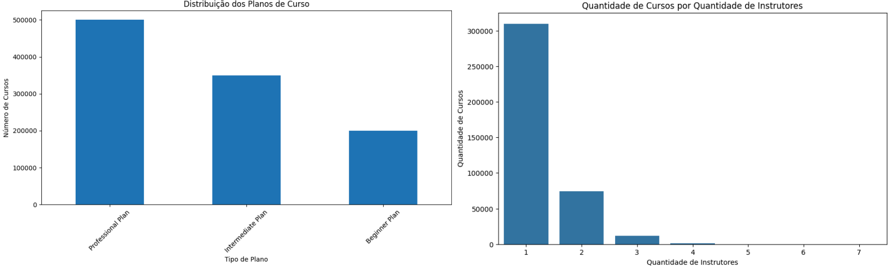

Distribuição de Instrutores por Quantidade de Cursos Lecionados, Aulas por Cursos e de Assinantes por Planos
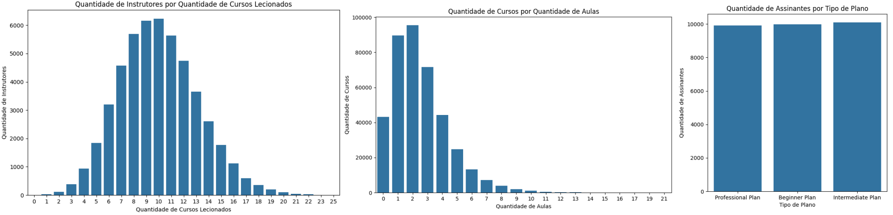

# Consultas (Enunciado, SQL e Otimização)

## Primeira Consulta

Essa consulta seleciona os cursos que possam conter
algum termo específico no título, bem como que possuam um número de aulas maior do que algum escolhido.

```sql
SELECT
    course.code AS "course code",
    course.title AS "course title",
    instructor.name AS "course instructor",
    course.category AS "category",
    COUNT(lesson.code) AS "number of lessons"
FROM
    course
INNER JOIN
    lesson ON course.code = lesson.code
INNER JOIN
    instructor ON course.instructor_id = instructor.id
WHERE
    course.title LIKE '%<termo_aqui>%'
GROUP BY
    course.code,
    instructor.name
HAVING
    COUNT(lesson.code) > <numero_aqui>
ORDER BY
    "number of lessons" DESC;
```

Seleciona o código, título, instrutor e a categoria do curso e faz uma contagem das aulas que têm como o seu código, o mesmo do código do curso selecionado. Para isso, faz uma junção interna com a tabela das aulas e dos instrutores. Filtra os títulos dos cursos para o termo no título, agrupa os resultados pelo código, título e categoria do curso e nome do instrutor, e, filtra esse agrupamento pelos que possuem o número de aulas maior que um número escolhido, ordenando esse número de modo decrescente.

Especificações do Computador:

* **Armazenamento:** 117 GB
* **Processador:** Intel(R) Celeron(R) N4020 CPU @ 1.10GHz 1.10 GHz
* **RAM instalada:** 4,00 GB (utilizável: 3,65 GB)
* **PostgreSQL:** Versão 16

```sql
SELECT
    course.code AS "course code",
    course.title AS "course title",
    instructor.name AS "course instructor",
    course.category AS "category",
    COUNT(lesson.code) AS "number of lessons"
FROM
    course
INNER JOIN
    lesson ON course.code = lesson.code
INNER JOIN
    instructor ON course.instructor_id = instructor.id
WHERE
    course.title LIKE '%wer%'
GROUP BY
    course.code,
    instructor.name
HAVING
    COUNT(lesson.code) > 7
ORDER BY
    "number of lessons" DESC;
```

### Plano de Consulta

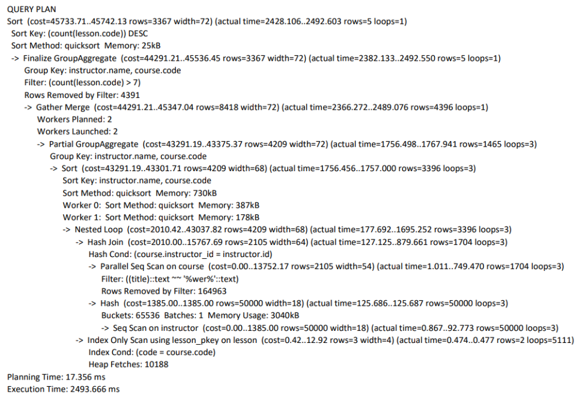
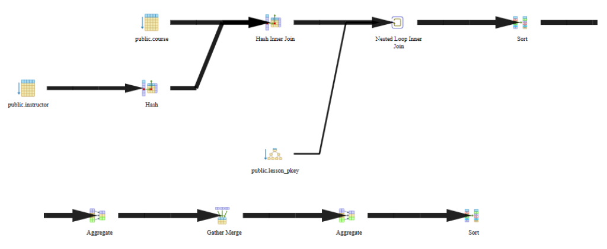

#### Statistics per Node Type
| Node type | Count | Time spent | % of query |
|:---|---:|---:|---:|
| Aggregate | 2 | 13.866 ms | 0.32% |
| Gather Merge | 1 | 1491.424 ms | 34.13% |
| Hash | 1 | 155.342 ms | 3.56% |
| Hash Inner Join | 1 | 353.533 ms | 8.09% |
| Index Only Scan | 1 | 0.406 ms | 0.01% |
| Nested Loop Inner Join | 1 | 2090.03 ms | 47.82% |
| Seq Scan | 2 | 197.987 ms | 4.53% |
| Sort | 2 | 68.321 ms | 1.57% |

#### Análise

  * **`Sort`**

    ```text
    Sort (cost=45733.71..45742.13 rows=3367 width=72) (actual time=2428.106..2492.603 rows=5 loops=1)
    Sort Key: (count(lesson.code)) DESC
    Sort Method: quicksort Memory: 25kB
    ```

    A operação de ordenação é aplicada ao resultado final da consulta, organizando-o com base na contagem das aulas em ordem decrescente. ([Referência](https://www.postgresql.org/docs/current/queries-order.html))

  * **`-> Finalize GroupAggregate`**

    ```text
    Finalize GroupAggregate (cost=44291.21..45536.45 rows=3367 width=72) (actual time=2382.133..2492.550 rows=5 loops=1)
    Group Key: instructor.name, course.code
    Filter: (count(lesson.code) > 7)
    Rows Removed by Filter: 4391
    ```

    A operação **“Finalize GroupAggregate”** finaliza a agregação dos grupos, agrupando por `instructor.name` e `course.code`, e aplica o filtro para o número de aulas ser maior que 7. ([Referência](https://www.postgresql.org/docs/current/queries-table-expressions.html))

  * **`-> Gather Merge`**

    ```text
    Gather Merge (cost=44291.21..45347.04 rows=8418 width=72) (actual time=2366.272..2489.076 rows=4396 loops=1)
    Workers Planned: 2
    Workers Launched: 2
    ```

    O **“Gather Merge”** combina os resultados dos “workers” paralelos e os mescla em uma única sequência ordenada. ([Referência](https://www.postgresql.org/docs/current/parallel-plans.html))

  * **`-> Partial GroupAggregate`**

    ```text
    Partial GroupAggregate (cost=43291.19..43375.37 rows=4209 width=72) (actual time=1756.498..1767.941 rows=1465 loops=3)
    Group Key: instructor.name, course.code
    ```

    A operação **“Partial GroupAggregate”** realiza uma agregação parcial em cada “worker”, agrupando por `instructor.name` e `course.code`.

  * **`-> Sort`**

    ```text
    Sort (cost=43291.19..43301.71 rows=4209 width=68) (actual time=1756.456..1757.000 rows=3396 loops=3)
    Sort Key: instructor.name, course.code
    Sort Method: quicksort Memory: 730kB
    Worker 0: Sort Method: quicksort Memory: 387kB
    Worker 1: Sort Method: quicksort Memory: 178kB
    ```

  * **`-> Nested Loop`**

    ```text
    Nested Loop (cost=2010.42..43037.82 rows=4209 width=68) (actual time=177.692..1695.252 rows=3396 loops=3)
    ```

    É utilizado o **“Nested Loop”** para combinar o resultado da junção com a tabela Hash com as tuplas de aulas já filtradas com a condição da consulta. ([Referência](https://www.postgresql.org/docs/current/using-explain.html))

  * **`-> Hash Join`**

    ```text
    Hash Join (cost=2010.00..15767.69 rows=2105 width=64) (actual time=127.125..879.661 rows=1704 loops=3)
    Hash Cond: (course.instructor_id = instructor.id)
    ```

      * **`-> Parallel Seq Scan on course`**
        ```text
        Parallel Seq Scan on course (cost=0.00..13752.17 rows=2105 width=54) (actual time=1.011..749.470 rows=1704 loops=3)
        Filter: ((title)::text ~~ '%wer%'::text)
        Rows Removed by Filter: 164963
        ```

    O **“Hash Join”** está sendo usado para combinar as tabelas de cursos e de instrutores com a condição de junção `course.instructor_id = instructor.id`, enquanto uma varredura sequencial é feita em paralelo na tabela de cursos, filtrando os que possuem o termo de string em seu título. ([Referência](https://www.google.com/search?q=https.postgresql.org/docs/current/using-explain.html))

  * **`-> Hash`**

    ```text
    Hash (cost=1385.00..1385.00 rows=50000 width=18) (actual time=125.686..125.687 rows=50000 loops=3)
    Buckets: 65536 Batches: 1 Memory Usage: 3040kB
    ```

      * **`-> Seq Scan on instructor`**
        ```text
        Seq Scan on instructor (cost=0.00..1385.00 rows=50000 width=18) (actual time=0.867..92.773 rows=50000 loops=3)
        ```

    É construída uma tabela Hash para os instrutores com cerca de 65 mil Buckets.

  * **`-> Index Only Scan using lesson_pkey on lesson`**

    ```text
    Index Only Scan using lesson_pkey on lesson (cost=0.42..12.92 rows=3 width=4) (actual time=0.474..0.477 rows=2 loops=5111)
    Index Cond: (code = course.code)
    Heap Fetches: 10188
    ```

    Faz uma varredura no index “pkey” que é criado automaticamente para as chaves primárias na tabela das aulas. Com a condição de que o valor da coluna do código seja igual ao valor da coluna do código na tabela dos cursos. Ele precisou consultar além do índice e recuperar dados da tabela base (heap) 10188 vezes. ([Referência](https://www.postgresql.org/docs/current/indexes-index-only-scans.html))

> As operações mais custosas foram: **“Nested Loop Inner Join”** e **“Gather Merge”**.

### Otimização

```sql
WITH FilteredCourses AS (
    SELECT
        c.code,
        c.title,
        c.instructor_id,
        c.category
    FROM
        course c
    WHERE
        c.title LIKE '%wer%'
),
CourseLessonCounts AS (
    SELECT
        l.code,
        COUNT(l.code) AS lesson_count
    FROM
        lesson l
    JOIN
        FilteredCourses fc ON l.code = fc.code
    GROUP BY
        l.code
    HAVING
        COUNT(l.code) > 7
)
SELECT
    fc.code AS "course code",
    fc.title AS "course title",
    i.name AS "course instructor",
    fc.category AS "category",
    clc.lesson_count AS "number of lessons"
FROM
    CourseLessonCounts clc
JOIN
    FilteredCourses fc ON clc.code = fc.code
JOIN
    instructor i ON fc.instructor_id = i.id
ORDER BY
    clc.lesson_count DESC;
```

#### Plano Otimizado

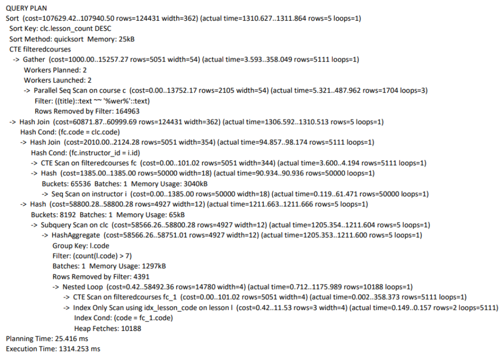
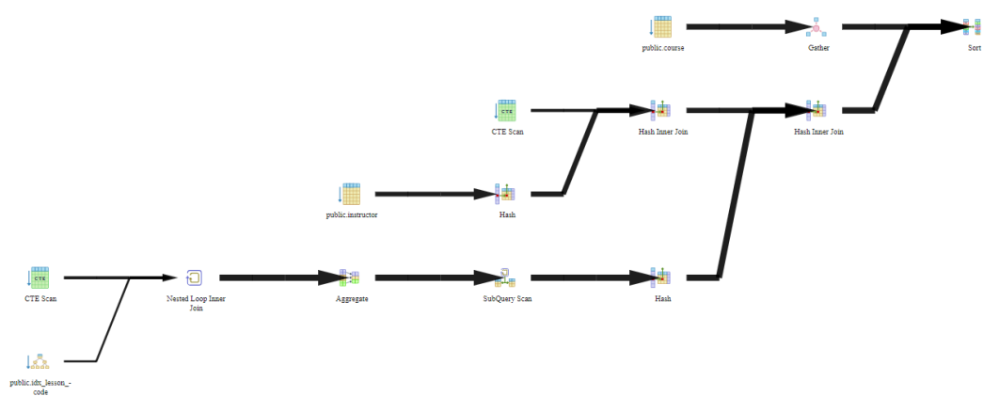

##### Statistics per Node Type
| Node type | Count | Time spent | % of query |
|:---|---:|---:|---:|
| Aggregate | 1 | 14.104 ms | 0.5% |
| CTE Scan | 2 | 2487.023 ms | 87.37% |
| Gather | 1 | 1637.23 ms | 57.52% |
| Hash | 2 | 24.416 ms | 0.86% |
| Hash Inner Join | 2 | 6,043 ms | 0.22% |
| Index Only Scan | 1 | 0.024 ms | 0.01% |
| Nested Loop Inner Join | 1 | 141.093 ms | 4.96% |
| Seq Scan | 2 | 1013.816 ms | 35.62% |
| Sort | 7 | 212.596 ms | 7.47% |
| Subquery Scan | 1 | 0.006 ms | 0.01% |

##### Análise

  * **`Sort`**

    ```text
    Sort (cost=107629.42..107940.50 rows=124431 width=362) (actual time=1310.627..1311.864 rows=5 loops=1)
    Sort Key: clc.lesson_count DESC
    Sort Method: quicksort Memory: 25kB
    ```

  * **`-> Gather`** (dentro de `CTE filteredcourses`)

    ```text
    -> Gather (cost=1000.00..15257.27 rows=5051 width=54) (actual time=3.593..358.049 rows=5111 loops=1)
       Workers Planned: 2
       Workers Launched: 2
       -> Parallel Seq Scan on course c (cost=0.00..13752.17 rows=2105 width=54) (actual time=5.321..487.962 rows=1704 loops=3)
          Filter: ((title)::text ~~ '%wer%'::text)
          Rows Removed by Filter: 164963
    ```

    É definida a tabela temporária (`CTE`) de filtragem inicial dos cursos. É feita uma varredura sequencial e paralela nos cursos, filtrando com a condição da consulta. O resultado de todos os "workers" é unido (`Gather`) e ordenado no final.

  * **`-> Hash Join`**

    ```text
    -> Hash Join (cost=60871.87..60999.69 rows=124431 width=362) (actual time=1306.592..1310.513 rows=5 loops=1)
       Hash Cond: (fc.code = clc.code)
    ```

      * **`-> Hash Join`**
        ```text
        -> Hash Join (cost=2010.00..2124.28 rows=5051 width=354) (actual time=94.857..98.174 rows=5111 loops=1)
           Hash Cond: (fc.instructor_id = i.id)
        ```
          * **`-> CTE Scan on filteredcourses fc`**
            ```text
            -> CTE Scan on filteredcourses fc (cost=0.00..101.02 rows=5051 width=344) (actual time=3.600..4.194 rows=5111 loops=1)
            ```
          * **`-> Hash`** (com `Seq Scan on instructor`)
            ```text
            -> Hash (cost=1385.00..1385.00 rows=50000 width=18) (actual time=90.934..90.936 rows=50000 loops=1)
               Buckets: 65536  Batches: 1  Memory Usage: 3040kB
               ->  Seq Scan on instructor i (cost=0.00..1385.00 rows=50000 width=18) (actual time=0.119..61.471 rows=50000 loops=1)
            ```
      * **`-> Hash`** (com `Subquery Scan`)
        ```text
        -> Hash (cost=58800.28..58800.28 rows=4927 width=12) (actual time=1211.663..1211.666 rows=5 loops=1)
           Buckets: 8192  Batches: 1  Memory Usage: 65kB
        ```

    É feito um `Hash Join` para juntar o resultado da tabela temporária (CTE) `FilteredCourses` com a tabela `instructor`. O resultado dessa junção é então combinado, via outro `Hash Join`, com os resultados lidos da `Subquery Scan` abaixo. ([Referência](https://www.postgresql.org/docs/current/queries-with.html))

  * **`-> Subquery Scan on clc`**

    ```text
    -> Subquery Scan on clc (cost=58566.26..58800.28 rows=4927 width=12) (actual time=1205.354..1211.604 rows=5 loops=1)
    ```

      * **`-> HashAggregate`**
        ```text
        -> HashAggregate (cost=58566.26..58751.01 rows=4927 width=12) (actual time=1205.353..1211.600 rows=5 loops=1)
           Group Key: l.code
           Filter: (count(l.code) > 7)
           Batches: 1  Memory Usage: 1297kB
           Rows Removed by Filter: 4391
        ```

    A operação `HashAggregate` agrupa os resultados, excluindo grupos com contagem de aulas menor ou igual a 7. O `Subquery Scan` lê esses resultados agregados para a junção na etapa anterior.

  * **`-> Nested Loop`**

    ```text
    -> Nested Loop (cost=0.42..58492.36 rows=14780 width=4) (actual time=0.712..1175.989 rows=10188 loops=1)
    ```

      * **`-> CTE Scan on filteredcourses fc_1`**
        ```text
        -> CTE Scan on filteredcourses fc_1 (cost=0.00..101.02 rows=5051 width=4) (actual time=0.002..358.373 rows=5111 loops=1)
        ```
      * **`-> Index Only Scan using idx_lesson_code on lesson l`**
        ```text
        -> Index Only Scan using idx_lesson_code on lesson l (cost=0.42..11.53 rows=3 width=4) (actual time=0.149..0.157 rows=2 loops=5111)
           Index Cond: (code = fc_1.code)
           Heap Fetches: 10188
        ```

    Faz a operação de `Nested Loop` para juntar o resultado da varredura das aulas (usando o índice `idx_lesson_code`) com a tabela temporária `FilteredCourses`. A operação utiliza o índice criado para o código das aulas, que se refere ao curso.

| | Consulta Inicial | Consulta Otimizada | Diferença (%) |
|:---|---:|---:|---:|
| Tempo de Execução 01 | 2351 ms | 1593 ms | 32,2% |
| Tempo de Execução 02 | 2360 ms | 1283 ms | 45,6% |
| Tempo de Execução 03 | 2146 ms | 1410 ms | 34,3% |
| Tempo de Execução 04 | 1980 ms | 1249 ms | 36,9% |
| Tempo de Execução 05 | 2200 ms | 1617 ms | 26,5% |
| Tempo Médio | 2207.4 ms | 1430,4 ms | 35,2% |

Ficou otimizado, principalmente por conta da utilização de “WITH Queries (Common Table Expressions)”, assim a filtragem é feita antes das junções, e, é possível observar que mais processos em paralelo ocorrem na análise dos nós. Também foi criado um índice para o código das aulas, no entanto ele não provocou mudanças significativas no tempo de execução, pois um “index pkey” já é criado automaticamente para todas as chaves primárias das tabelas.

## Segunda Consulta

Essa consulta lista os alunos inscritos em um plano específico e, seleciona também um curso que o aluno tenha acesso, com sua inscrição no plano ainda em andamento, a categoria e o instrutor do curso.

### Original

```sql
SELECT
    subscriber.username AS "username",
    subscriber.type AS "subscription plan",
    course.title AS "course title",
    course.category AS "course category",
    instructor.name AS "instructor name"
FROM
    subscriber
INNER JOIN
    plan ON plan.type = subscriber.type
INNER JOIN
    course_plan ON course_plan.type = plan.type
INNER JOIN
    course ON course.code = course_plan.code
LEFT JOIN
    instructor ON instructor.id = course.instructor_id
WHERE
    course.code = <chosen_id>
    AND plan.type = '<chosen_plan>'
    AND subscriber.end_date > CURRENT_DATE;
```

### Otimizada

```sql
SELECT
    s.username AS "username",
    s.type AS "subscription plan",
    c.title AS "course title",
    c.category AS "course category",
    i.name AS "instructor name"
FROM
    (SELECT username, type, end_date FROM subscriber WHERE end_date > CURRENT_DATE) s
JOIN
    (SELECT type FROM plan WHERE type LIKE '<chosen_plan>') p ON p.type = s.type
JOIN
    (SELECT type, code FROM course_plan WHERE code = <chosen_id>) cp ON cp.type = p.type
JOIN
    (SELECT code, title, category, instructor_id FROM course) c ON c.code = cp.code
LEFT JOIN
    instructor i ON i.id = c.instructor_id;
```

Especificações do Computador:

* **Armazenamento:** 457 GB
* **Processador:** AMD Ryzen 5 5500U with Radeon Graphics 2.10 GHz
* **RAM instalada:** 16 GB (utilizável: 15,4 GB)
* **PostgreSQL:** Versão 16

Aqui estão os tempos de execução organizados em uma lista para maior clareza.

### Execução (Original)

1.  **Execução 1:**
    * **Planning Time:** 1.596 ms
    * **Execution Time:** 14.458 ms
2.  **Execução 2:**
    * **Planning Time:** 2.769 ms
    * **Execution Time:** 12.546 ms
3.  **Execução 3:**
    * **Planning Time:** 3.586 ms
    * **Execution Time:** 16.442 ms
4.  **Execução 4:**
    * **Planning Time:** 2.326 ms
    * **Execution Time:** 14.791 ms
5.  **Execução 5:**
    * **Planning Time:** 3.549 ms
    * **Execution Time:** 17.344 ms

### Execução (Otimizada)

1.  **Execução 1:**
    * **Planning Time:** 4.692 ms
    * **Execution Time:** 10.604 ms
2.  **Execução 2:**
    * **Planning Time:** 6.462 ms
    * **Execution Time:** 12.343 ms
3.  **Execução 3:**
    * **Planning Time:** 4.497 ms
    * **Execution Time:** 11.203 ms
4.  **Execução 4:**
    * **Planning Time:** 4.882 ms
    * **Execution Time:** 11.623 ms
5.  **Execução 5:**
    * **Planning Time:** 4.604 ms
    * **Execution Time:** 9.852 ms

| Média da execução inicial | Média da execução otimizada | Melhoria de desempenho |
|:---|---:|---:|
| 15,1162 ms | 11,125 ms | 26,4% |

### Plano de Consulta

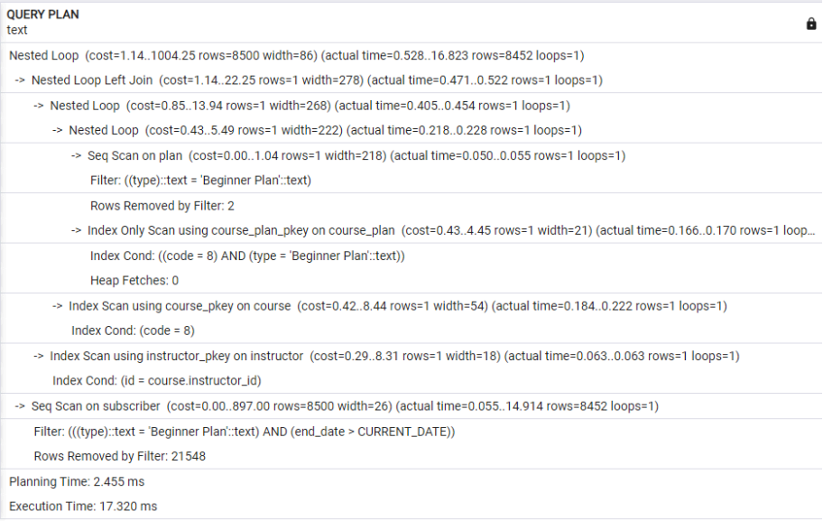
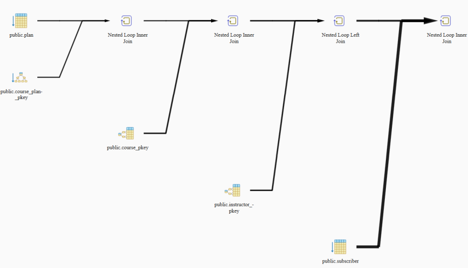

#### Statistics per Node Type
| Node type | Count | Time spent | % of query |
|:---|---:|---:|---:|
| Index Only Scan | 1 | 0.081 ms | 1.11% |
| Index Scan | 2 | 0.068 ms | 0.93% |
| Nested Loop Inner Join | 3 | 0.725 ms | 9.87% |
| Nested Loop Left Join | 1 | 0.002 ms | 0.03% |
| Seq Scan | 2 | 6.474 ms | 88.11% |

### Plano Otimizado

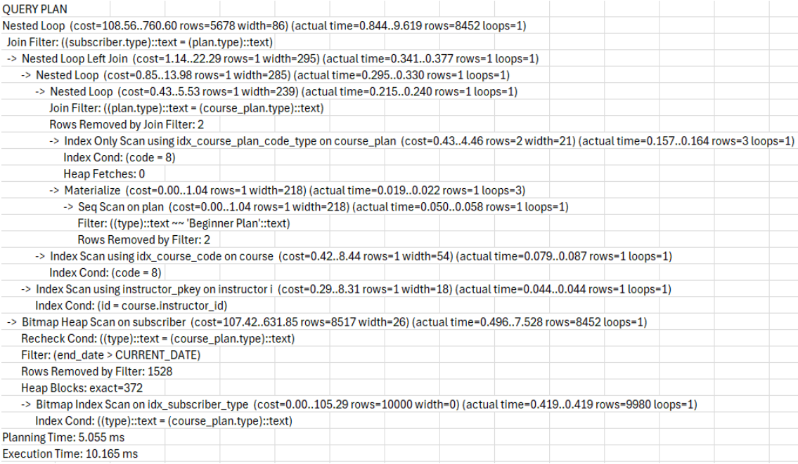
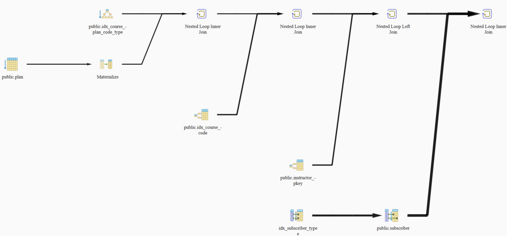


### Análise Plano Inicial

1.  ```text
    Nested Loop  (cost=1.14..1004.25 rows=8500 width=86) (actual time=0.528..16.823 rows=8452 loops=1)
    ```

    Ocorre um `Nested Loop` que é uma junção básica de tabelas, com os seguintes valores estimados: valor de início de operação de “1.14” e de conclusão da operação de “1004.25” (valores arbitrários), retorno de 8500 linhas com 86 bytes cada. Em seguida, apresenta-se o mesmo, mas com os valores reais + o loop, que indica que a operação só foi realizada uma vez na consulta.

2.  ```text
    ->  Nested Loop Left Join  (cost=1.14..22.25 rows=1 width=278) (actual time=0.471..0.522 rows=1 loops=1)
    ```

    Uma operação semelhante à acima ocorre aqui, porém com um `Left Join`, ou seja, uma junção à esquerda.

3.  ```text
    ->  Nested Loop  (cost=0.85..13.94 rows=1 width=268) (actual time=0.405..0.454 rows=1 loops=1)
    ->  Nested Loop  (cost=0.43..5.49 rows=1 width=222) (actual time=0.218..0.228 rows=1 loops=1)
    ```

    Em ambas as linhas ocorre o mesmo explicado anteriormente (explicação presente no tópico 1).

4.  ```text
    ->  Seq Scan on plan  (cost=0.00..1.04 rows=1 width=218) (actual time=0.050..0.055 rows=1 loops=1)
           Filter: ((type)::text = 'Beginner Plan'::text)
           Rows Removed by Filter: 2
    ```

    Nesta linha, ocorre uma varredura sequencial (`Seq Scan`) da tabela `plan`, utilizando como filtro da varredura o texto “Beginner Plan”, que remove 2 linhas que não atendem à condição do filtro.

5.  ```text
    ->  Index Only Scan using course_plan_pkey on course_plan  (cost=0.43..4.45 rows=1 width=21) (actual time=0.166..0.170 rows=1 loops=1)
           Index Cond: ((code = 8) AND (type = 'Beginner Plan'::text))
           Heap Fetches: 0
    ```

    Ocorre um `Index Only Scan`, ou seja, uma varredura utilizando o índice `course_plan_pkey` (a chave primária da tabela), sem necessidade de acesso aos dados da tabela `course_plan`. A condição aplicada no índice (`Index Cond`) é que o atributo `code` seja 8 e o `type` seja “Beginner Plan”. `Heap Fetches: 0` indica que toda a informação foi obtida diretamente do índice.

6.  ```text
    ->  Index Scan using course_pkey on course  (cost=0.42..8.44 rows=1 width=54) (actual time=0.184..0.222 rows=1 loops=1)
    ```

    É feita uma varredura no índice (`Index Scan`) através da chave primária da tabela `course`.

7.  ```text
    ->  Index Scan using instructor_pkey on instructor  (cost=0.29..8.31 rows=1 width=54) (actual time=0.184..0.222 rows=1 loops=1)
           Index Cond: (id = course.instructor_id)
    ```

    Mesma condição que acima (tópico 6), mas com a tabela `instructor` e com a condição (`Index Cond`) de que o atributo `id` desta tabela tenha o mesmo valor do atributo `id` da tabela `course`.

8.  ```text
    ->  Seq Scan on subscriber  (cost=0.00..897.00 rows=8500 width=26) (actual time=0.055..14.914 rows=8452 loops=1)
           Filter: (((type)::text = 'Beginner Plan'::text) AND (end_date > CURRENT_DATE))
           Rows Removed by filter: 21548
    ```

    Aqui é feita uma varredura sequencial na tabela `subscriber`, tendo como filtros o tipo de plano igual a “Beginner Plan” e a data de término (`end_date`) maior que a data atual. Estes filtros removem 21548 registros.

9.  ```text
    Planning Time: 2.455 ms
    Execution time: 17.320 ms
    ```

    Por fim, o plano de consulta retorna o tempo de planejamento (`Planning Time`) de 2.455 ms e o tempo total de execução (`Execution Time`) de 17.320 ms.

-----

### Análise Plano Otimizado

1.  ```text
    Nested Loop  (cost=108.56..760.60 rows=5678 width=86) (actual time=0.844..9.619 rows=8452 loops=1)
       Join Filter: ((subscriber.type)::text = (plan.type)::text)
    ```

    Ocorre um `Nested Loop`. O filtro de junção (`Join Filter`) acontece quando o `type` da tabela `subscriber` tem o mesmo valor que o `type` da tabela `plan`.

2.  ```text
    ->  Nested Loop Left Join  (cost=1.14..22.29 rows=1 width=295) (actual time=0.341..0.377 rows=1 loops=1)
    ```

    Uma operação semelhante à acima ocorre aqui, porém com um `Left Join`, ou seja, uma junção à esquerda.

3.  ```text
    ->  Nested Loop  (cost=0.85..13.98 rows=1 width=285) (actual time=0.295..0.330 rows=1 loops=1)
    ```

    Aqui também ocorre o `Nested Loop`, explicado no tópico 1.

4.  ```text
    ->  Nested Loop  (cost=0.43..5.53 rows=1 width=239) (actual time=0.215..0.240 rows=1 loops=1)
           Join Filter: ((plan.type)::text = (course_plan.type)::text)
           Rows Removed by Join Filter: 2
    ```

    Semelhante ao explicado em 1, porém com a junção das tabelas `plan` e `course_plan` via igualdade entre os `type` de ambas.

5.  ```text
    ->  Index Only Scan using idx_course_plan_code_type on course_plan  (cost=0.43..4.46 rows=2 width=21) (actual time=0.157..0.164 rows=3 loops=1)
           Index Cond: (code = 8)
           Heap Fetches: 0
    ```

    Ocorre um `Index Only Scan` utilizando o índice composto `idx_course_plan_code_type` (criado manualmente). A condição é que o `code` seja 8.

6.  ```text
    ->  Materialize  (cost=0.00..1.04 rows=1 width=218) (actual time=0.019..0.022 rows=1 loops=3)
    ```

    Aqui é utilizado o operador `Materialize`, que armazena temporariamente o resultado de uma subconsulta na memória. `loops=3` indica que o resultado foi reutilizado 3 vezes.

7.  ```text
    ->  Seq Scan on plan  (cost=0.00..1.04 rows=1 width=218) (actual time=0.050..0.058 rows=1 loops=1)
           Filter: ((type)::text ~~ 'Beginner Plan'::text)
           Rows Removed by Filter: 2
    ```

    Ocorre uma varredura sequencial na tabela `plan`, utilizando o operador `LIKE` (`~~`) para filtrar pelo texto “Beginner Plan”.

8.  ```text
    ->  Index Scan using idx_course_code on course  (cost=0.42..8.44 rows=1 width=54) (actual time=0.079..0.087 rows=1 loops=1)
           Index Cond: (code = 8)
    ```

    É feita uma varredura no índice artificial `idx_course_code`, onde a condição é `code = 8`.

9.  ```text
    ->  Index Scan using instructor_pkey on instructor i  (cost=0.29..8.31 rows=1 width=18) (actual time=0.044..0.044 rows=1 loops=1)
           Index Cond: (id = course.instructor_id)
    ```

    Ação idêntica à acima, mas com o índice da chave primária da tabela `instructor`.

10. ```text
    ->  Bitmap Heap Scan on subscriber  (cost=107.42..631.85 rows=8517 width=26) (actual time=0.496..7.528 rows=8452 loops=1)
           Recheck Cond: ((type)::text = (course_plan.type)::text)
           Filter: (end_date > CURRENT_DATE)
           Rows Removed by Filter: 1528
           Heap Blocks: exact=372
    ```

    A operação lê uma matriz de bits das páginas (`Bitmap Heap Scan`) na tabela `subscriber`, com um filtro na data de término (`end_date`).

11. ```text
    ->  Bitmap Index Scan on idx_subscriber_type  (cost=0.00..105.29 rows=10000 width=0) (actual time=0.419..0.419 rows=9980 loops=1)
           Index Cond: ((type)::text = (course_plan.type)::text)
    ```

    Cria uma matriz de páginas (`Bitmap`) que será lida na etapa acima (item 10), utilizando o índice `idx_subscriber_type`.

12. ```text
    Planning Time: 5.055 ms
    Execution Time: 10.165 ms
    ```

    O tempo de planejamento foi de 5.055 ms e o tempo de execução foi de 10.165 ms.

#### Statistics per Node Type
| Node type | Count | Time spent | % of query |
|---|---|---|---|
| Bitmap Heap Scan | 1 | 2.343 ms | 59.96% |
| Bitmap Index Scan | 1 | 0.253 ms | 6.48% |
| Index Only Scan | 1 | 0.098 ms | 2.51% |
| Index Scan | 2 | 0.097 ms | 2.49% |
| Materialize | 1 | 0.001 ms | 0.03% |
| Nested Loop Inner Join | 3 | 1.107 ms | 28.33% |
| Nested Loop Left Join | 1 | 0.003 ms | 0.08% |
| Seq Scan | 1 | 0.008 ms | 0.21% |

## Programação com Banco de Dados

### Funções Armazenadas no Servidor de BD:

```sql
CREATE OR REPLACE FUNCTION consulta_leonardo (
    IN title_term VARCHAR(100), 
    IN min_lessons INT
)
RETURNS TABLE (
    course_code INT, 
    course_title VARCHAR(100),
    course_instructor VARCHAR(100),
    category VARCHAR(50), 
    number_of_lessons INT
)
LANGUAGE plpgsql
AS $$
BEGIN
    RETURN QUERY
    WITH FilteredCourses AS (
        SELECT
            c.code, 
            c.title, 
            c.instructor_id,
            c.category
        FROM course c
        WHERE c.title LIKE '%' || title_term || '%'
    ),
    CourseLessonCounts AS (
        SELECT
            l.code, 
            COUNT(l.code) AS lesson_count
        FROM lesson l
        JOIN FilteredCourses fc ON l.code = fc.code
        GROUP BY l.code
        HAVING COUNT(l.code) > min_lessons
    )
    SELECT
        fc.code, 
        fc.title, 
        i.name, 
        fc.category,
        CAST(clc.lesson_count AS INT)
    FROM CourseLessonCounts clc
    JOIN FilteredCourses fc ON clc.code = fc.code
    JOIN instructor i ON fc.instructor_id = i.id
    ORDER BY clc.lesson_count DESC;
END;
$$;
```

A função `consulta_leonardo` filtra os cursos com base em um termo de cadeia de caracteres no seu título e em uma quantidade mínima de aulas, assim como a sua consulta correspondente, podendo agora ser executada pela função facilmente com diferentes termos e números de aulas passados como parâmetros a partir de: `SELECT * FROM consulta_leonardo('<term in title>', <chosen number>);`. Como essa função não usa a construção de strings SQL em tempo de execução com o SQL dinâmico em que é feita a concatenação dos parâmetros direto ao SQL, eles nesse caso da função construída são tratados como dados (`VARCHAR(100)` e `INT`) não permitindo injeções de SQL. Seus parâmetros de **entrada** são: o termo de busca que será utilizado para filtrar os títulos dos cursos e o número mínimo de aulas que um curso deve ter para ser incluído no resultado. Já os de **saída** é uma tabela com as seguintes colunas de todos os registros correspondentes: o código do curso, o título do curso, o nome do instrutor que ministra o curso, a categoria do curso e o número de aulas do curso.

```sql
CREATE OR REPLACE FUNCTION consulta_marcos (
    IN chosen_plan VARCHAR(50),
    IN chosen_code INT
)
RETURNS TABLE (
    username VARCHAR(100),
    subscription_plan VARCHAR(50),
    course_title VARCHAR(100),
    course_category VARCHAR(50),
    instructor_name VARCHAR(100)
)
LANGUAGE plpgsql
AS $$
BEGIN
    RETURN QUERY
    SELECT
        s.username AS "username",
        s.type AS "subscription_plan",
        c.title AS "course_title",
        c.category AS "course_category",
        i.name AS "instructor_name"
    FROM
        (SELECT s.username, type, end_date FROM
        subscriber s WHERE end_date > CURRENT_DATE) s
    JOIN
        (SELECT type FROM plan WHERE type LIKE
        chosen_plan) p ON p.type = s.type
    JOIN
        (SELECT type, code FROM course_plan WHERE
        code = chosen_code) cp ON cp.type = p.type
    JOIN
        (SELECT code, title, category, instructor_id
        FROM course) c ON c.code = cp.code
    LEFT JOIN
        instructor i ON i.id = c.instructor_id;
END;
$$;
```

A função `consulta_marcos` filtra assinantes e cursos com base em um plano e um curso escolhidos. Ela pode ser executada ao passar os parâmetros do plano e do curso, usando a seguinte consulta: `SELECT * FROM consulta_marcos('<chosen_plan>', <chosen_code>);`. A função não utiliza SQL dinâmico para concatenar parâmetros diretamente à string SQL, evitando vulnerabilidades de injeção de SQL. Os parâmetros de **entrada** são: o plano de assinatura e o código do curso. O **resultado** é uma tabela com os registros correspondentes que contém as seguintes colunas: nome de usuário, plano de assinatura, título do curso, categoria do curso e o nome do instrutor.

#### Controle de Acesso de Usuários

Perfis de Usuário: (SELECT (S), INSERT (I), DELETE (D) e UPDATE (U)):

| | Administrador | Instrutor | Aluno | Anônimo |
| :--- | :--- | :--- | :--- | :--- |
| **Curso** | S, I, U, D | S, I, U, D | S | S |
| **Curso_Plano** | S, I, U, D | Sem acesso | S | S |
| **Instrutor** | S, I, U, D | S | S | Sem acesso |
| **Aula** | S, I, U, D | S, I, U, D | S | Sem acesso |
| **Plano** | S, I, U, D | Sem acesso | S | S |
| **Inscrito** | S, I, U, D | Sem acesso | S (username = `current_user`) | Sem acesso |

Diagrama de Concessões de Usuários:

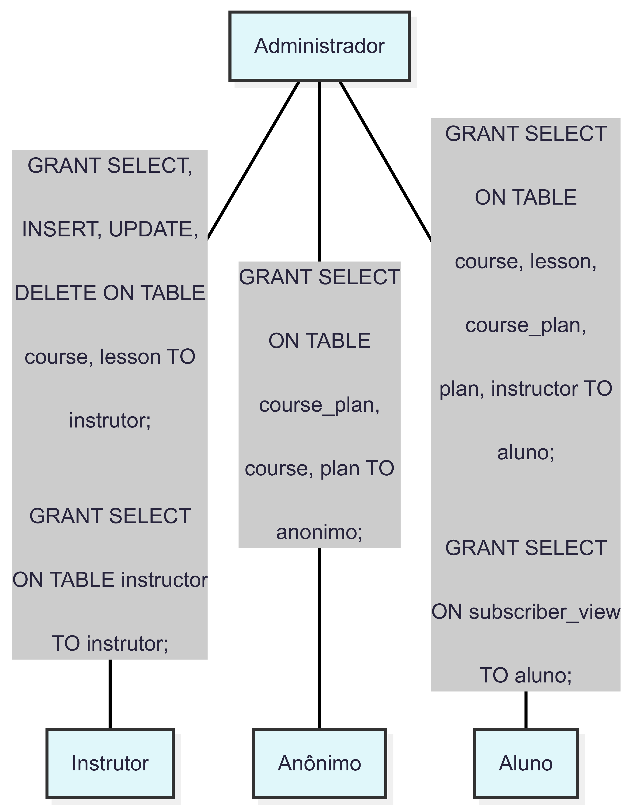

Existem quatro perfis de usuários na aplicação. Dentre eles, destacam-se:
* **Usuário Anônimo:** Ao entrar na aplicação, pode consultar apenas os `planos` e os `cursos` com seus tipos de plano correspondentes.
* **Administrador:** Possui acesso irrestrito a todas as `tabelas` e a todas as operações possíveis, sendo responsável pelo gerenciamento completo do sistema.

```sql
CREATE USER administrador WITH PASSWORD 'sorocaba';
ALTER USER administrador WITH SUPERUSER;
ALTER DATABASE "TechEduStream" OWNER TO administrador;
ALTER TABLE subscriber OWNER TO administrador;
ALTER TABLE course_plan OWNER TO administrador;
ALTER TABLE course OWNER TO administrador;
ALTER TABLE plan OWNER TO administrador;
ALTER TABLE lesson OWNER TO administrador;
ALTER TABLE instructor OWNER TO administrador;

SET ROLE administrador;
SELECT CURRENT_USER;

CREATE USER anonimo;
GRANT SELECT ON TABLE course_plan, course, plan TO anonimo;

SET ROLE anonimo;
SELECT * FROM plan;
SELECT cp.type, c.title, c.category, c.description FROM
course_plan cp JOIN course c ON cp.code = c.code;

SET ROLE administrador;
```

Já o usuário do tipo `instrutor` tem acesso total aos seus cursos e suas aulas. Ele também tem o acesso de leitura à tabela de `instrutores`. Foi criada uma função que retorna apenas os seus próprios cursos e as aulas correspondentes, de modo com que o usuário no papel de `instrutor` possua seu nome como o ID do instrutor que está salvo no sistema.

Para que o `instrutor` não possa alterar, inserir ou deletar cursos e aulas de outros instrutores, foram criadas duas `triggers`. Essas `triggers` permitem apenas que sejam alterados registros de aulas e cursos do próprio instrutor (exceto o `administrador`, que pode alterar qualquer registro das tabelas, independentemente do instrutor).

Ao criar esse usuário com o ID do instrutor, não foi possível colocar o ID sozinho por conter somente números. Por isso, foi necessário adicionar um prefixo de caracteres ao ID. Por exemplo: se o ID do instrutor for `“1”`, o usuário com o perfil de `instrutor` é criado com o nome `“instr_1”`. A função que ele utilizará para ver seus cursos irá extrair apenas os números do seu nome de usuário para buscar os registros correspondentes ao seu ID.

```sql
CREATE ROLE instrutor;
GRANT SELECT, INSERT, UPDATE, DELETE ON TABLE course, lesson TO instrutor;
GRANT SELECT ON TABLE instructor TO instrutor;

CREATE USER instr_212 WITH PASSWORD 'kelsey_richardson' IN ROLE instrutor;

CREATE OR REPLACE FUNCTION checagem_permissao_instrutor_curso()
RETURNS TRIGGER AS $$
BEGIN
    -- Permite que o administrador ignore a verificação
    IF CURRENT_USER = 'administrador' THEN
        IF TG_OP = 'DELETE' THEN
            RETURN OLD;
        ELSE
            RETURN NEW;
        END IF;
    END IF;

    -- Verifica a permissão para DELETE
    IF TG_OP = 'DELETE' THEN
        IF EXISTS (
            SELECT 1
            FROM course
            WHERE OLD.instructor_id = CAST(SUBSTRING(CURRENT_USER FROM '[0-9]+') AS INT)
        ) THEN
            RETURN OLD;
        ELSE
            RAISE EXCEPTION 'Permissão negada: você não pode modificar este curso';
        END IF;
    -- Verifica a permissão para INSERT ou UPDATE
    ELSE
        IF EXISTS (
            SELECT 1
            FROM course
            WHERE NEW.instructor_id = CAST(SUBSTRING(CURRENT_USER FROM '[0-9]+') AS INT)
        ) THEN
            RETURN NEW;
        ELSE
            RAISE EXCEPTION 'Permissão negada: você não pode modificar este curso';
        END IF;
    END IF;
END;
$$ LANGUAGE plpgsql;

CREATE OR REPLACE TRIGGER curso_permissao_trigger
BEFORE INSERT OR UPDATE OR DELETE ON course
FOR EACH ROW
EXECUTE FUNCTION checagem_permissao_instrutor_curso();

CREATE OR REPLACE FUNCTION checagem_permissao_instrutor_aula()
RETURNS TRIGGER AS $$
BEGIN
    -- Permite que o administrador ignore a verificação
    IF CURRENT_USER = 'administrador' THEN
        IF TG_OP = 'DELETE' THEN
            RETURN OLD;
        ELSE
            RETURN NEW;
        END IF;
    END IF;

    -- Verifica a permissão para DELETE
    IF TG_OP = 'DELETE' THEN
        IF EXISTS (
            SELECT 1
            FROM course c
            WHERE c.code = OLD.code
            AND c.instructor_id = CAST(SUBSTRING(CURRENT_USER FROM '[0-9]+') AS INT)
        ) THEN
            RETURN OLD;
        ELSE
            RAISE EXCEPTION 'Permissão negada: você não pode deletar esta aula';
        END IF;
    -- Verifica a permissão para INSERT ou UPDATE
    ELSE
        IF EXISTS (
            SELECT 1
            FROM course c
            WHERE c.code = NEW.code
            AND c.instructor_id = CAST(SUBSTRING(CURRENT_USER FROM '[0-9]+') AS INT)
        ) THEN
            RETURN NEW;
        ELSE
            RAISE EXCEPTION 'Permissão negada: você não pode modificar esta aula';
        END IF;
    END IF;
END;
$$ LANGUAGE plpgsql;

CREATE OR REPLACE TRIGGER aula_permissao_trigger
BEFORE INSERT OR UPDATE OR DELETE ON lesson
FOR EACH ROW
EXECUTE FUNCTION checagem_permissao_instrutor_aula();

CREATE OR REPLACE FUNCTION get_instructor_courses()
RETURNS TABLE (
    instructor_id INT, 
    course_code INT, 
    course_title VARCHAR,
    lesson_title VARCHAR, 
    lesson_description TEXT
) AS $$
BEGIN
    RETURN QUERY
    SELECT 
        c.instructor_id AS instructor_id, 
        c.code AS course_code, 
        c.title AS course_title, 
        l.title AS lesson_title,
        l.description AS lesson_description
    FROM course c 
    JOIN lesson l ON l.code = c.code
    WHERE c.instructor_id = CAST(SUBSTRING(CURRENT_USER FROM '[0-9]+') AS INT);
END;
$$ LANGUAGE plpgsql;

-- Testando as permissões e a função
SET ROLE instr_212;
SELECT * FROM get_instructor_courses();
SET ROLE administrador;
```

Os **alunos** têm permissão de leitura (`SELECT`) em quase todas as tabelas do banco de dados, com exceção da tabela `subscriber`. Para garantir a privacidade, eles não acessam esta tabela diretamente, mas sim uma `visão` (view) específica que filtra os registros com a condição `username = current_user`. Isso impede que um aluno acesse os dados de outro.

O acesso a essa `visão` e às outras tabelas é o que permite ao aluno consultar seus `cursos` e `aulas` de acordo com seu `plano` de assinatura, além de obter informações sobre o `instrutor` de cada curso.

Toda essa lógica é consolidada em uma `função` específica para o aluno. Essa função utiliza o `current_user` para identificar o aluno logado e retorna todos os registros relevantes do seu plano, incluindo os cursos, aulas e os respectivos instrutores.

```sql
CREATE ROLE aluno;
GRANT SELECT ON TABLE course, lesson, course_plan, plan, instructor TO aluno;

CREATE VIEW subscriber_view AS
SELECT * FROM subscriber
WHERE username = current_user;

GRANT SELECT ON subscriber_view TO aluno;

CREATE USER user_33 WITH PASSWORD '_pSn6j6k1$' IN ROLE aluno;

CREATE OR REPLACE FUNCTION get_student_courses() 
RETURNS TABLE (
    username VARCHAR, 
    course_code INT, 
    course_title VARCHAR,
    plan_type VARCHAR, 
    plan_price FLOAT, 
    lesson_title VARCHAR,
    lesson_description TEXT, 
    instructor_name VARCHAR,
    instructor_biography TEXT
) AS $$
BEGIN
    RETURN QUERY
    SELECT
        s.username,
        c.code AS course_code, 
        c.title AS course_title, 
        p.type AS plan_type,
        p.price AS plan_price, 
        l.title AS lesson_title,
        l.description AS lesson_description,
        i.name AS instructor_name, 
        i.biography AS instructor_biography
    FROM
        subscriber_view s 
        JOIN course_plan cp ON s.type = cp.type
        JOIN course c ON cp.code = c.code 
        JOIN plan p ON s.type = p.type
        JOIN lesson l ON l.code = c.code 
        JOIN instructor i ON c.instructor_id = i.id;
END;
$$ LANGUAGE plpgsql;

-- Testando as permissões e a função
SET ROLE user_33;
SELECT * FROM get_student_courses();
SET ROLE administrador;
```

**Dono do Banco de Dados**
| Database name | Owner name |
| :--- | :--- |
| TechEduStream | administrador |

**Dono das Tabelas**
| tablename | tableowner |
| :--- | :--- |
| course\_plan | administrador |
| plan | administrador |
| subscriber | administrador |
| course | administrador |
| lesson | administrador |
| instructor | administrador |

Conexões usando perfis de usuários:

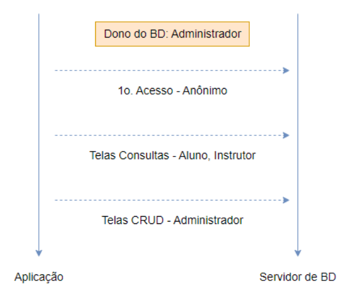